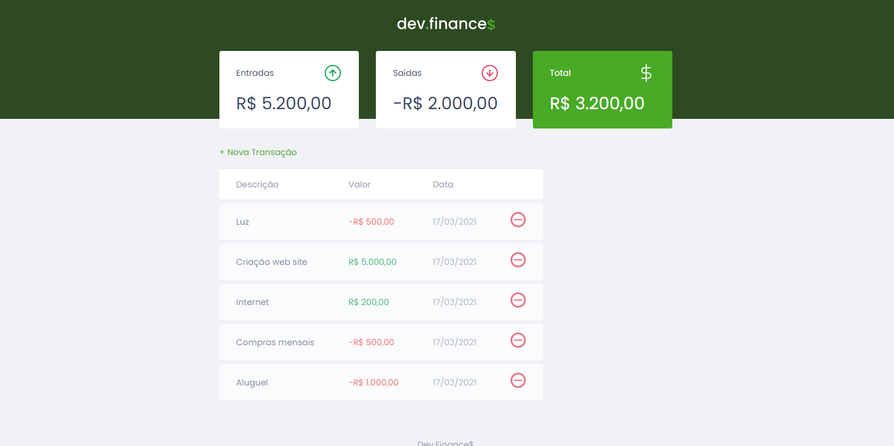

# __Dev.Finances$__

## Codado utilizando curso da [Rocketseat](https://www.rocketseat.com.br/) utilizando __JavaScript__,  __HTML__ e __CSS__.

## O objetivo desta Agenda de controle financeiro é criar um controle monetário para o usuario, podendo adicionar saldos positivos e negativos com a propria devolvendo o valor como negativo, positivo ou 0.

